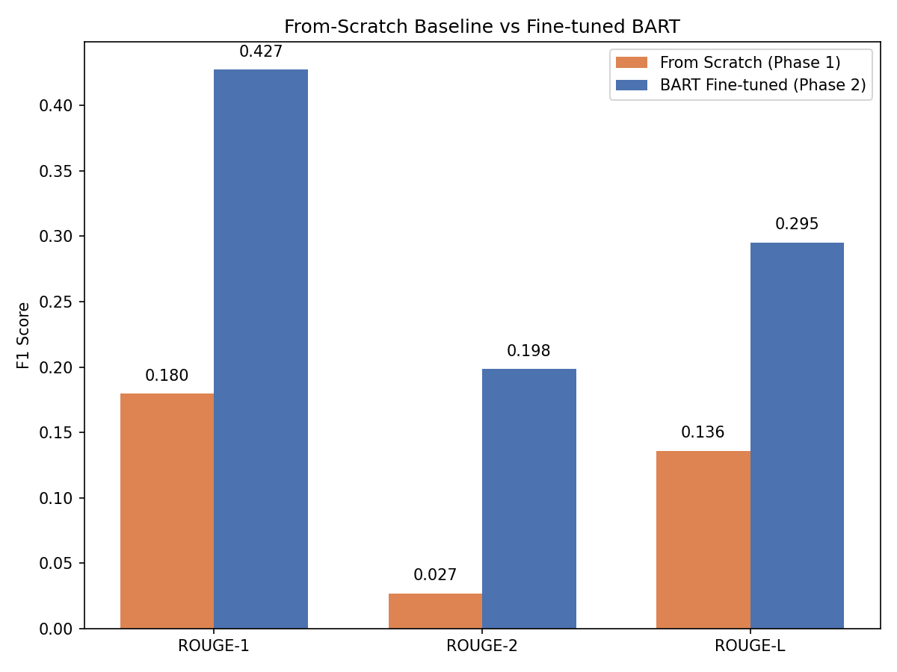
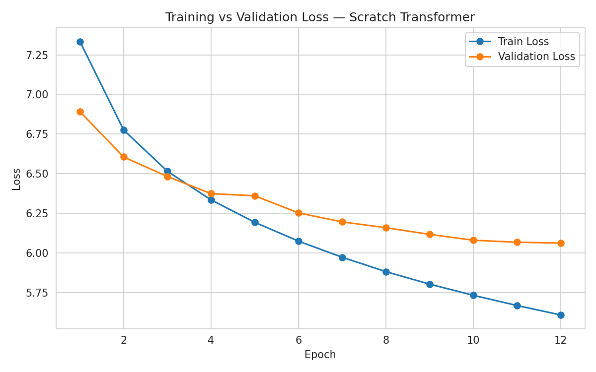
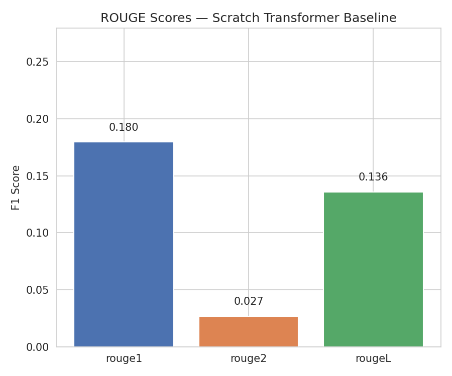
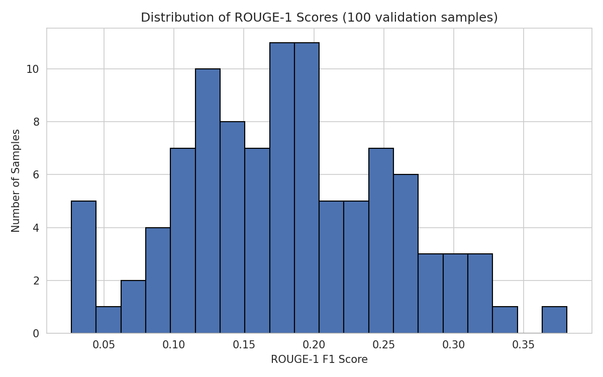
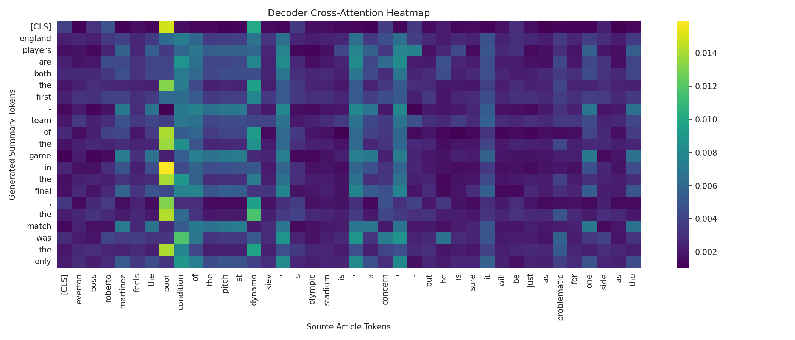
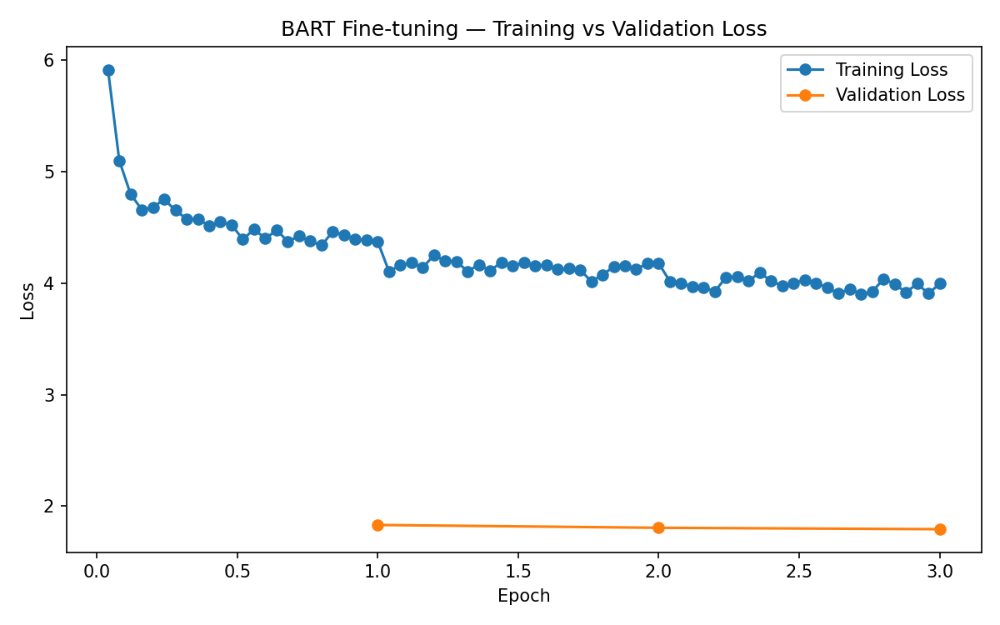

# Text Summarization with Transformers: From Scratch vs. Fine-Tuning

An end-to-end exploration of abstractive text summarization using Transformer
architectures, comparing a **from-scratch Encoder-Decoder Transformer** against a
**fine-tuned pretrained model (BART)** on the same dataset and metrics — to
empirically demonstrate the impact of large-scale pretraining.

## Overview

This project is built in two phases:

| Phase | Approach | Goal |
|---|---|---|
| **Phase 1** | Encoder-Decoder Transformer implemented from scratch (PyTorch) | Understand the internal mechanics of a Transformer |
| **Phase 2** | Fine-tuning `facebook/bart-base` (Hugging Face) | Achieve strong summarization performance and quantify the pretraining gap |

Both phases are trained and evaluated on the same subset of the **CNN/DailyMail**
dataset, using the same ROUGE metrics, for a direct, apples-to-apples comparison.

## Why Two Phases?

Using a pretrained model alone would give strong results quickly, but would skip
the actual learning objective: understanding *how* a Transformer works internally —
positional encoding, multi-head attention, masking, and the encoder-decoder split.

Phase 1 implements the architecture from ["Attention Is All You Need"](https://arxiv.org/abs/1706.03762)
(Vaswani et al., 2017) component by component. Phase 2 then shows what large-scale
pretraining adds on top of that same architecture, using the exact same task and
evaluation setup.

## Task

**Abstractive summarization**: given a news article, generate a new, fluent summary
that captures its meaning — rather than extracting existing sentences. This requires
the full encoder-decoder architecture: the encoder builds a contextual representation
of the article, and the decoder generates the summary token by token, attending back
to that representation via cross-attention.

## Dataset

[CNN/DailyMail](https://www.kaggle.com/datasets/gowrishankarp/newspaper-text-summarization-cnn-dailymail) —
news articles paired with human-written multi-sentence summaries, the standard
benchmark for summarization research.

- Phase 1: 20,000 training articles, 800 validation articles (subset, for
  feasible training time on a single GPU)
- Phase 2: 15,000 training articles, 1,000 validation articles

## Architecture (Phase 1 — From Scratch)

A standard Transformer encoder-decoder, implemented without any pretrained weights:

- Sinusoidal positional encoding
- Scaled dot-product multi-head self-attention
- Encoder layers (self-attention + feed-forward)
- Decoder layers (masked self-attention + cross-attention + feed-forward)
- Teacher forcing during training, with a causal (look-ahead) mask
- Greedy decoding at inference time

Tokenization uses a pretrained BERT WordPiece tokenizer (`bert-base-uncased`) —
this is a preprocessing step only; the model itself contains no pretrained weights.

**Config**: `d_model=256`, `n_heads=8`, `d_ff=1024`, `n_layers=4`, trained for 12 epochs.

## Model (Phase 2 — Fine-Tuned)

[`facebook/bart-base`](https://huggingface.co/facebook/bart-base), fine-tuned end-to-end
on the same summarization task using Hugging Face's `Seq2SeqTrainer`, for 3 epochs.

## Results

| Metric | From Scratch (Phase 1) | BART Fine-tuned (Phase 2) |
|---|---|---|
| ROUGE-1 | 0.180 | 0.429 |
| ROUGE-2 | 0.027 | 0.199 |
| ROUGE-L | 0.136 | 0.295 |

Fine-tuning a pretrained model more than doubles ROUGE-1 and nearly 7x's ROUGE-2
compared to the from-scratch baseline — despite Phase 2 using a *smaller* training
set. This highlights how much of a Transformer's language understanding comes from
pretraining rather than task-specific training alone.



### Sample Output

**Article excerpt**: *[Jerdon's Babbler rediscovery in Myanmar]*

| | Summary |
|---|---|
| **Reference** | Was last spotted in Burma in 1941, and was thought to have died out. Scientists used a recording of its distinctive call to rediscover species. |
| **From Scratch** | the photographer was found dead in the north carolina in the north london. the water was found in the past... |
| **BART Fine-tuned** | Jerdon's Babbler was last spotted in Myanmar in 1941 and was thought to have died out altogether. But a team of scientists managed to uncover multiple birds nesting in a small area of grassland... |

## Visualizations

**Phase 1 — From-Scratch Transformer**

Training vs. validation loss:



ROUGE-1/2/L scores on the validation set:



Distribution of ROUGE-1 across validation samples:



Decoder cross-attention heatmap — which source tokens the model attends to while
generating each summary token:



**Phase 2 — Fine-Tuned BART**

Training vs. validation loss:



Both notebooks also include side-by-side sample prediction tables (reference vs.
generated summary vs. ROUGE-1 score).

## Repository Structure

```
.
├── Images/                                             # Visualization assets used in this README
├── scratch-transformer-summarization-baseline.ipynb   # Phase 1: from-scratch Transformer
├── bart-finetuned-summarization.ipynb                 # Phase 2: fine-tuned BART
├── README.md
├── LICENSE
└── .gitignore
```

## Requirements

- Python 3.10+
- PyTorch
- transformers
- datasets
- rouge_score
- pandas, numpy, matplotlib, seaborn

Both notebooks were developed and run on [Kaggle Notebooks](https://www.kaggle.com/)
with GPU acceleration (T4 x2).

## How to Run

1. Open each notebook on Kaggle (or locally with the dataset downloaded)
2. Add the [CNN/DailyMail dataset](https://www.kaggle.com/datasets/gowrishankarp/newspaper-text-summarization-cnn-dailymail) via **Add Input**
3. Enable a GPU accelerator
4. Run all cells top to bottom

## Key Takeaways

- Implementing a Transformer from scratch clarifies exactly how self-attention,
  positional encoding, and encoder-decoder cross-attention work together
- Even an undertrained from-scratch model shows non-random attention patterns,
  confirming the architecture is learning meaningful structure
- Pretraining provides a substantial head start that task-specific training alone
  cannot easily replicate on limited data and compute

## License

This project is licensed under the [MIT License](LICENSE).

## Author

**Eman Hisham Ismail (Emy)**
AI / Machine Learning & Deep Learning
[GitHub](https://github.com/eman774) · [Kaggle](https://www.kaggle.com/emanhishamismail)
